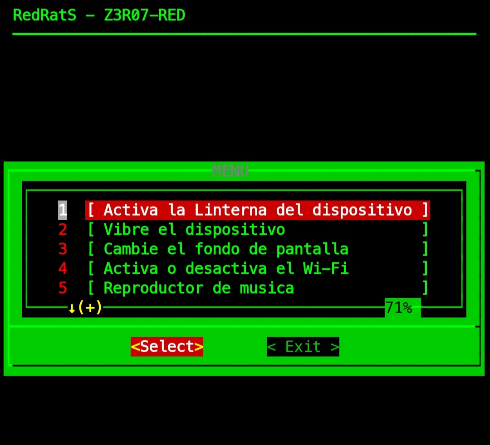

Esta herramienta requiere la apk termux-api para su correcto funcionamiento.

REQUIERE:

* Última versión de Termux 
* python3 
* pip3

ACTUALIZAR PAQUETES:

* apt update
* apt upgrade -y

USO:

* cd RedRatS/
* chmod +x RedRatS.sh
* chmod +x requirements.txt
* pip3 install -r requirements.txt
* bash RedRatS.sh

